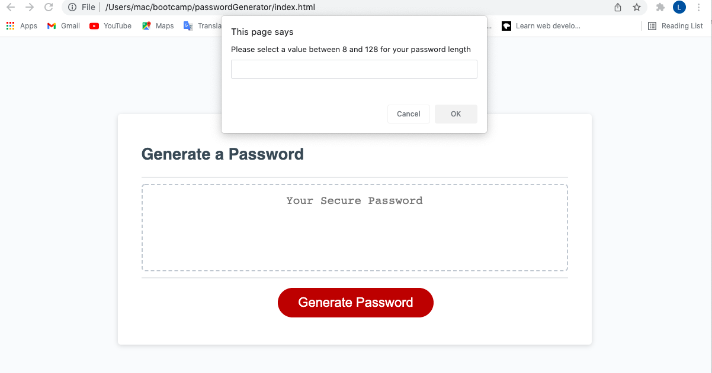
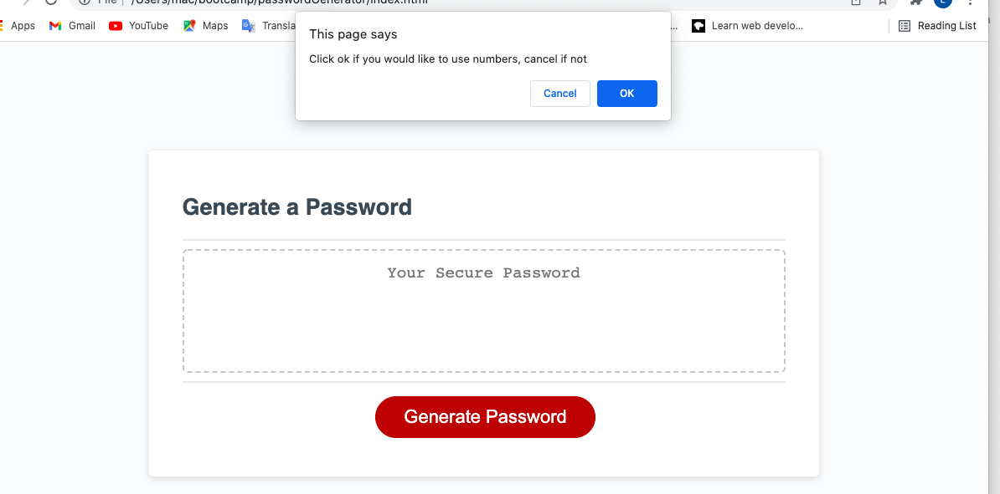
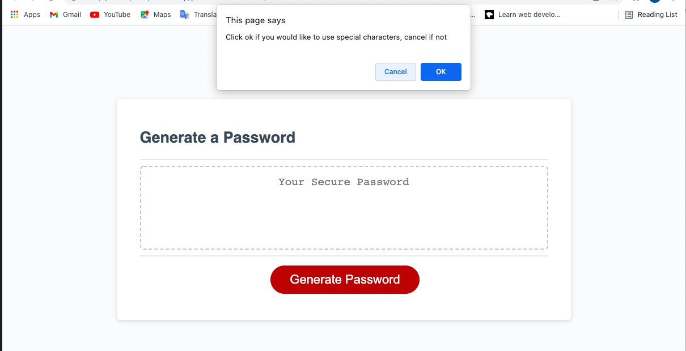
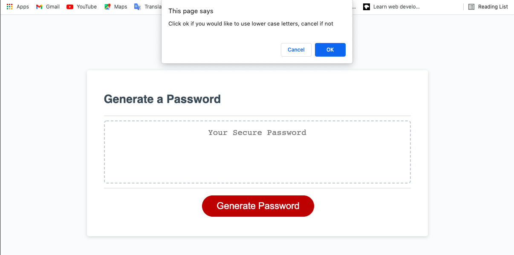
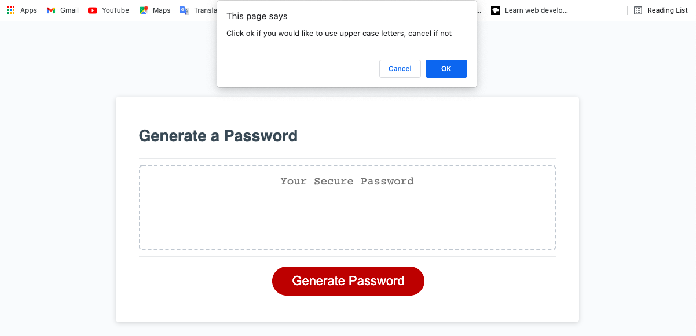
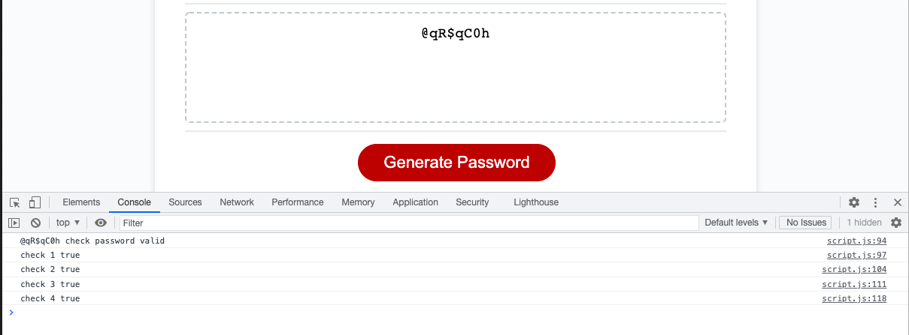
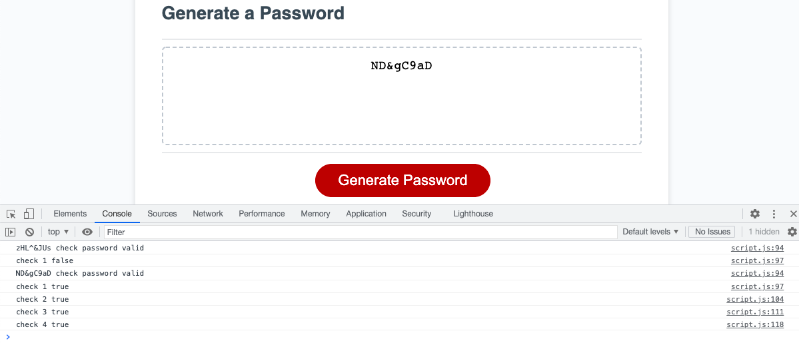

# 03 JavaScript: Password Generator

## The Project

For this project we had to create a random password generator that meets certain criteria so that the user
could create a strong password that provides greater security. The page was to include a button to click to 
generate a password. When the button is clicked the user is to be prompted for password criteria. When prompted
for the length the password must be at least 8 characters and no more than 128 characters. When asked for character
types to be included in the password, the user needs to confirm if they want numbers, special characters, lowere case letters or uppercase letters. Once all the prompts are answered the input will be validated if atleast 1 character type if entered. Once the password is generated, it should be written on the page.

## Finished Product
> **Note** : This shows where the user enters their number of characters for the password.

> **Note** : This shows where the user selects if they would like numbers in their password

> **Note** : This shows where the user selects if they would like special character's in their password

> **Note** : This shows where the user selects if they would like lower case letter's in their password

> **Note** : This shows where the user selects if they would like upper case letter's in their password

> **Note** : This shows where the user selects 8 characters for the password and selects all the character sets, that the password is checked to see it has all the character sets included in it.

> **Note** : This shows where the user selects 8 characters for the password and selects all the character sets, that the password is checked to see it has all the character sets included in it.

## A link to the webpage is shown below:
https://lconnell1000.github.io/passwordGenerator/